# Designing Chemistry Images That Work — a Depiction Agent

This is the nucleus for an **agentic workflow that designs 2-D depictions of
metal–organic complexes that are actually *good***: ChemDraw-style drawings with
correct connectivity, readable coordination geometry, and no crossings, collisions,
or atoms stuffed inside rings. It distills the work in `metaldepict/` into the
pieces an agent needs: **how a depiction is judged**, the **design rules** it must
satisfy, the **drawing vocabulary**, and the **self-optimizing loop** that searches
for a layout that passes the judge.

The thesis: *depiction quality is measurable.* If you can score a drawing, an agent
can optimize it — and a human only has to intervene on the last 5%.

---

## 1. Architecture

```
  ┌─────────────┐   connectivity   ┌──────────────────┐   2-D scene   ┌──────────┐
  │  THE AGENT  │ ───────────────► │   THE TOOL       │ ────────────► │  JUDGE   │
  │ feeds a mol │  RDKit Mol with  │ seed → relax →   │   metrics     │ score()  │
  │ (donor→metal│  DATIVE bonds +  │ relief → polish  │ ◄──────────── │ tiers    │
  │  dative,    │  η-n haptic rings│ (self-optimizes) │   keep best   └──────────┘
  │  η-n option)│                  └──────────────────┘
  └─────────────┘                          │ render
                                           ▼
                                    SVG / PNG  +  editable HTML canvas (drag/rotate)
                                           │
                                           ▼  save / verify
                              coordination InChI + geometry signature
```

* **The agent** only supplies *connectivity*: an RDKit `Mol` where donor→metal bonds
  are `DATIVE`, ancillary metal–X bonds are ordinary covalent bonds, and an η-n
  ligand has every ring carbon `DATIVE`-bonded to the metal (the "cyclopentyl η5"
  option). Adding a complex = writing a connectivity feeder; no new drawing code.
  See `complexes.py` (`build_ru_pnp`, `build_pd_biaryl`, `build_grubbs2`, …).
* **The tool** (`seed_from_smiles.scene_from_mol` + `relax_harness.Harness` +
  `relaxer_energy.relax`) seeds a 2-D layout from RDKit, runs a rigid-body spring
  relaxer, applies relief moves, and polishes.
* **The judge** (`relax_harness.quality_loss` / `penalties`, `complexes._score`)
  turns a drawing into a number; the tool **self-optimizes** against it.
* **The canvas** (`canvas.py` → `panels/complexes_canvas.html`) lets a human drag /
  rotate the result for the last bit of taste.

---

## 2. How a depiction is judged ← *the heart of it*

A relaxed drawing is reduced to `Harness.metrics()`, then scored. The judge is split
into **penalty terms** (continuous, "reference-like = low") and a **3-tier problem
score** (discrete hard/soft gates the optimizer must clear).

### 2a. Penalty terms — `relax_harness.penalties(H)` / `quality_loss(H)`

Each term is a metric × a weight (`DEFAULT_JUDGE`). Lower is better. They are
**exposed to the optimizer** so it can target the very numbers it's graded on.

| term | metric | what it punishes | weight |
|------|--------|------------------|-------:|
| `bond`    | `bondCV`        | non-uniform skeletal bond lengths | 6.5 |
| `ring`    | `ringEdgeCV`    | irregular ring edges | 7.0 |
| `ringang` | `ringAngleDev`  | non-regular ring angles | 0.05 |
| `jang`    | `angleDevDeg`   | off junction angles (P, metal, bridges) | 0.08 |
| `coord`   | `coordLenErr`   | donor→metal / metal–H not at target length | 1.6 |
| `overlap` | `overlap`       | each strictly-overlapping non-bonded pair | 1.0 |
| `crowd`   | `crowd`         | soft near-contact (rewards whitespace) | 1.0 |
| `sym`     | `symDev`        | broken symmetry about the principal axis | 1.2 |

### 2b. The 3-tier problem score — `complexes._score(H)`

```
score = ( HARD , overlaps , quality_loss )      # compared lexicographically
HARD  = crossings  +  atoms-inside-a-ring(<8)  +  real-collisions
```

* **Tier 0 — HARD (never accepted).** Three things must be **zero**, always:
  1. **Bond crossings** — `count_crossings()`, segment intersection of non-adjacent
     bonds. Ranked first because a crossing is the most misleading error.
  2. **Atoms inside a ring < 8** — point-in-polygon over *all* rings *and* the
     **chelate metallacycles** (which the ring finder skips because it never
     traverses the metal). Nothing belongs inside a small ring. (The η-n centroid
     anchors and frozen disc atoms are exempt — they sit at the ring centre by
     construction.)
  3. **Real collisions** — atom pairs closer than `0.55 L`, distinct from soft
     label-proximity overlaps.
* **Tier 1 — soft overlaps.** Label halos grazing each other; minimized but not a
  hard failure (a Grubbs mesityl periphery will always have a few).
* **Tier 2 — `quality_loss`.** The continuous penalty sum from §2a; the tie-breaker.

### 2c. The self-optimizing loop — `complexes.render()`

> *As long as a result has a HARD problem, keep trying more options. Keep the best
> by the judge. Stop the moment a result is hard-clean with no overlaps.*

It searches over **recipes** (= schedules of weights + relief moves) **× abbreviation
levels**:

```
attempts = [proven] + RECIPES  (each at abbr "min", then "max")
for each attempt:  build → score → keep if better → stop if (HARD==0 and overlaps==0)
```

`RECIPES` encode *different weights and constraints introduced at different times*:
`baseline`, `overlap-first`, `angle-late`, `relief-heavy`, `overlap-heavy`,
`crowd-relief`. A "recipe" is a list of `(weight-set, [relief ops])` stages, e.g.
`crowd` deliberately drops the angle weight and raises bond+overlap so a jam is
relieved by **stretching bonds before distorting angles** (bonds are cheaper to bend
than angles).

This is the agentic core: **the judge defines "good," the search finds it, and the
human only sees results that already pass the hard gates.**

---

## 3. The design rules (what "good coordination chemistry drawing" means)

These are encoded as deterministic moves and/or judged constraints. Each one came
from a specific failure observed during the build:

* **Coordination geometry drives the metal fan.** 4-coordinate → square-planar (90°);
  6-coordinate → octahedral (per-pair target snapped to the nearest 45°, so a clean
  octahedron is *satisfiable*, not an unreachable uniform 90°); 5-coordinate →
  square-pyramidal even spacing.
* **Metal in a ring ⇒ ancillaries go OUTSIDE it.** `_place_ancillaries_outside`
  rotates each monodentate ligand of a chelated metal into the exterior arc (away
  from the chelate centroid). Fixes the Ru-MACHO H/Cl/CO and Fe-salen Cl that used to
  sit in the chelate cavity.
* **Biaryl monophosphine: C₁ and C₄ on the bond axis.** The pendant aryl is rotated
  about the biaryl axis into the plane so the metal···Cᵢₚₛₒ contact reads straight
  (ipso→para aligned with the bond), and its **Kekulé double bonds are kept**
  (consistent with the flat partner ring), not swapped for an aromatic circle.
* **η-n disc faces the metal.** The Cp ring is laid out as a perspective disc
  foreshortened *along* the metal→centroid axis (that axis is the ellipse's minor
  axis), with **the bold "front" edge always toward the viewer** (chosen by lowest
  edge-midpoint, so it stays centred even after the disc spins).
* **Spin the Cp to clear bulky substituents.** The disc rotates about its 5-fold
  axis (a real, coordination-preserving DOF) so the bulkiest substituent (t-Bu …)
  lands on the vertex farthest from the metal and points cleanly outward.
* **Cis OA pairs stay cis.** Pd-Ph / Pd-Br are kept adjacent and outside the chelate.
* **Consistent, crowding-gated abbreviations.** All four P-tBu groups become labels
  (not 1-of-4); the optimizer raises iPr/Cy/Bn to labels when the explicit drawing
  stays crowded. Abbreviation list is the standard reference set.
* **Bonds before angles; then polish.** A final polish holds the *challenging* pieces
  rigid (pins, η-n discs, rotated biaryl) and re-optimizes bond lengths + angles for
  the rest, re-extending stub bonds (iPr/Cy left short with empty space behind them).

---

## 4. The drawing vocabulary (`template_draw.Scene`)

`plain | wedge | dash | coord (dashed) | bold | taper` bonds; single/double
(full-length second line for terminal C=O / C=N, inset only for ring bonds) / triple
(metal carbonyl C≡O); aromatic-ring ellipse via principal axes; abbreviation
superatoms oriented so their **coordinating atom faces the parent bond** (M–CO drawn
`OC`, aryl-OMe drawn `MeO` when the ring is to the right). Donor→metal coordination
is the **dashed** bond; covalent ancillaries stay solid.

---

## 5. Save & verify the coordination geometry (`inchi_coord.py`)

Standard InChI *disconnects* metals. We emit the **reconnected-metal InChI** (the
`/RecMet` `/r` layer that preserves the metal–ligand bonds — the basis the InChI
v1.07 "Molecular Inorganics" work extends), and compute a **coordination signature**
(metal, ligand set, hapticity, coordination number, geometry class). The signature is
derived **both from the input connectivity and from the final 2-D depiction**, and
they **match for all 8** — proving the drawing faithfully represents the saved
geometry:

| complex | geometry (from mol == from depiction) |
|---|---|
| Ru-MACHO | octahedral |
| Pd-SPhos | square planar |
| Cu-oxalamide | trigonal planar |
| Fe-salen | square pyramidal |
| Grubbs II / Hoveyda | square pyramidal |
| Cp₂Rh | metallocene (sandwich) |
| Cp₂ZrCl₂ | bent metallocene |

---

## 6. The gallery

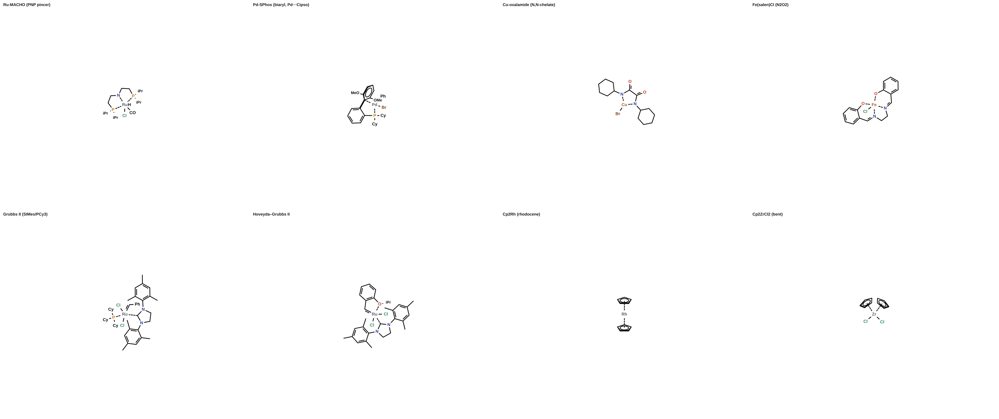

| | | | |
|:--:|:--:|:--:|:--:|
| 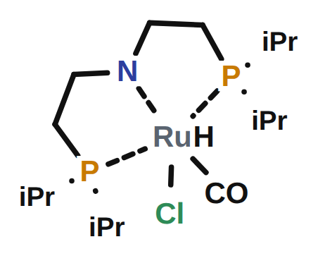 | 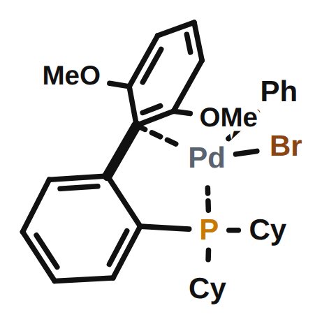 | 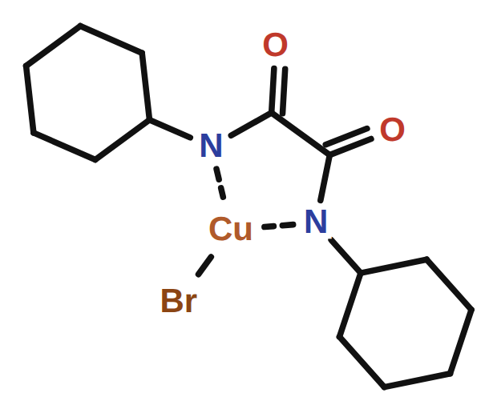 | 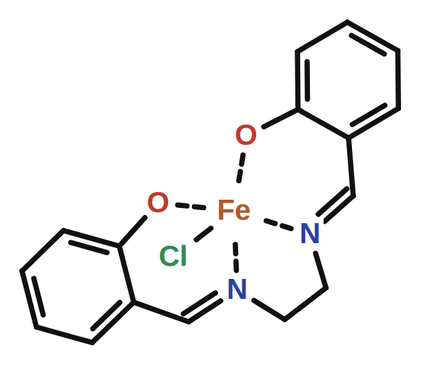 |
| Ru-MACHO (octahedral) | Pd-SPhos (Pd···Cᵢₚₛₒ) | Cu-oxalamide | Fe(salen)Cl |
| 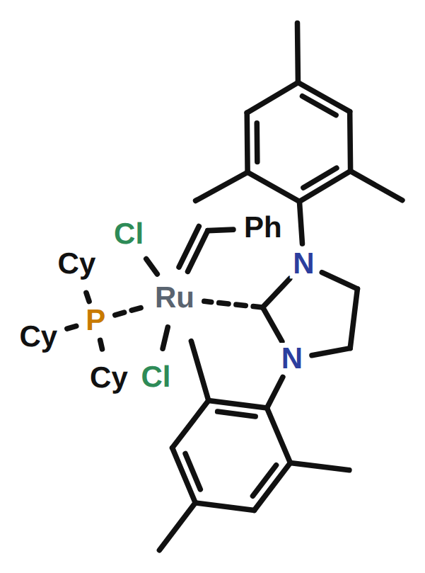 | 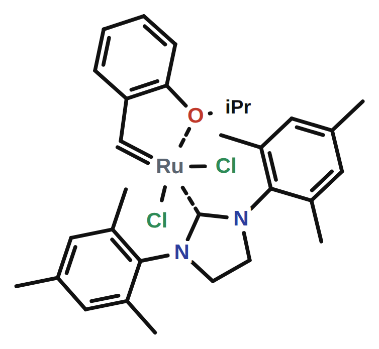 | 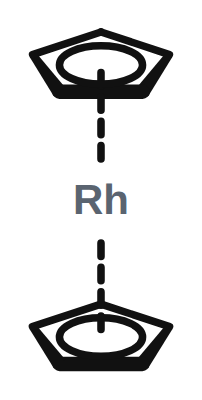 | 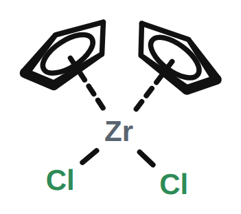 |
| Grubbs II (NHC/PCy₃) | Hoveyda–Grubbs | Cp₂Rh (sandwich) | Cp₂ZrCl₂ (bent) |

### Robustness — substitute a bulkier family member, re-run unchanged

The same pipeline survives bulkier variants (PtBu₂, XPhos, DiPP-oxalamide,
3,5-tBu-salen = Jacobsen, IPr/SIPr NHCs, Cp* and tBuCp metallocenes); the optimizer
keeps them hard-clean (8/8 in the latest round).

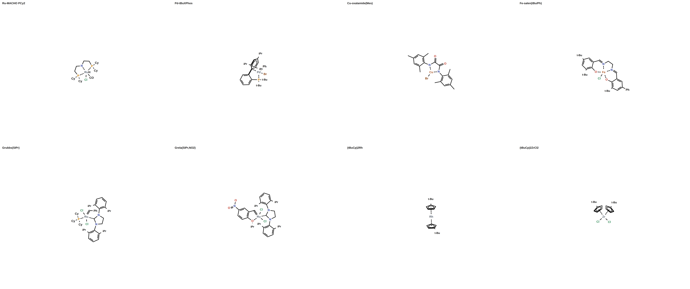

### The editable canvas (`panels/complexes_canvas.html`)

Drag an atom to move it · Shift-drag to rotate its group about the metal · Alt-drag
to rotate the whole molecule · download adjusted SVG/JSON. The human-in-the-loop tail.

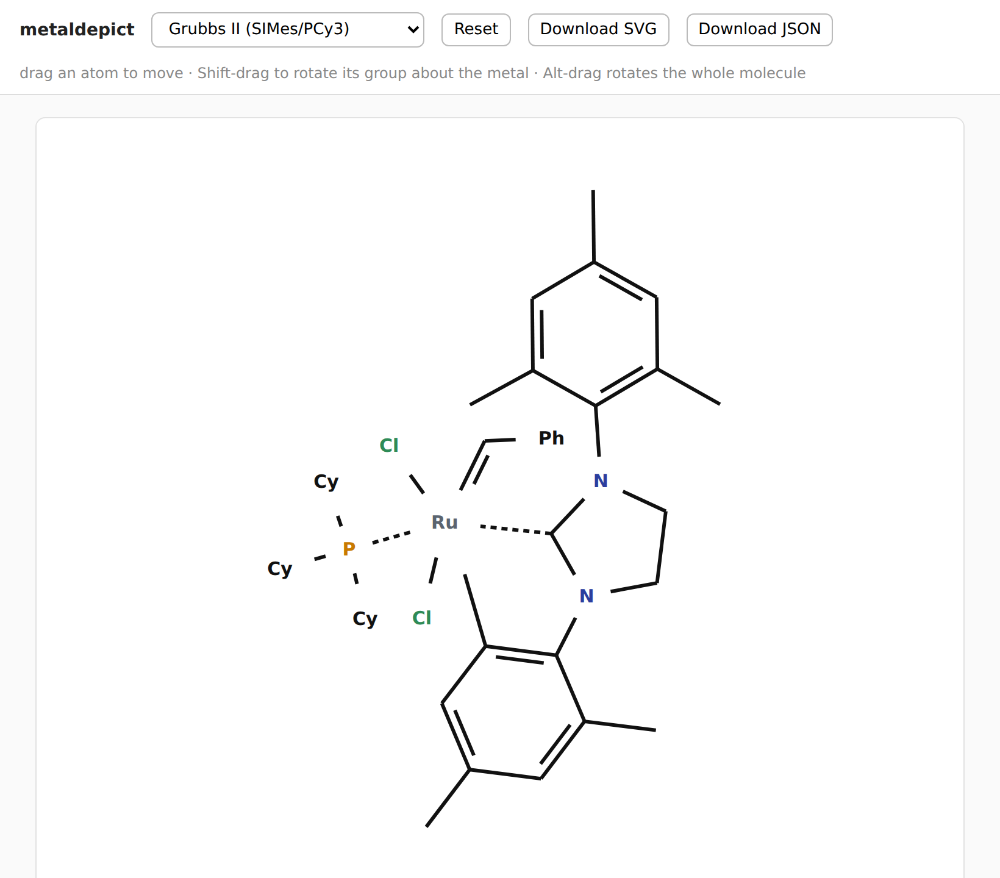

---

## 7. Run it

```bash
cd metaldepict/methods
python3 complexes.py          # builds the 8, writes panels/complexes_gallery.png,
                              # per-complex crops, and the editable canvas
python3 inchi_coord.py        # prints the geometry round-trip + reconnected InChI
```

Add a complex = add a connectivity feeder to `FEED` in `complexes.py` (or feed any
RDKit `Mol`). Everything else — seed, relax, relief, polish, judge, render — is shared.

---

## 8. Open problems / next steps for the agentic workflow

1. **3-D view.** A back/front (depth) view to disambiguate perspective and to seed the
   2-D from a real geometry — *not yet built*.
2. **Swap in the InChI v1.07 organometallic library** for the official organometallic
   string (currently RDKit's bundled InChI via `/RecMet`).
3. **Learn the judge weights.** The penalty weights are hand-set; an agent could tune
   them against human-rated "good vs bad" depictions.
4. **Reference-finding agent.** Fan-out web search for canonical depictions of a target
   family, distill the conventions, and feed them as new rules/recipes (the original
   multi-agent intent).
5. **A "completeness critic"** that asks *what's still wrong* (a stub, an off angle, a
   bold edge on the wrong side) and turns each into the next optimization move.

> The pieces are here: a scored objective, a search that optimizes it, deterministic
> chemical rules, and a human canvas for the tail. An agent that designs chemistry
> images is mostly a matter of *growing the judge and the move-set*.
