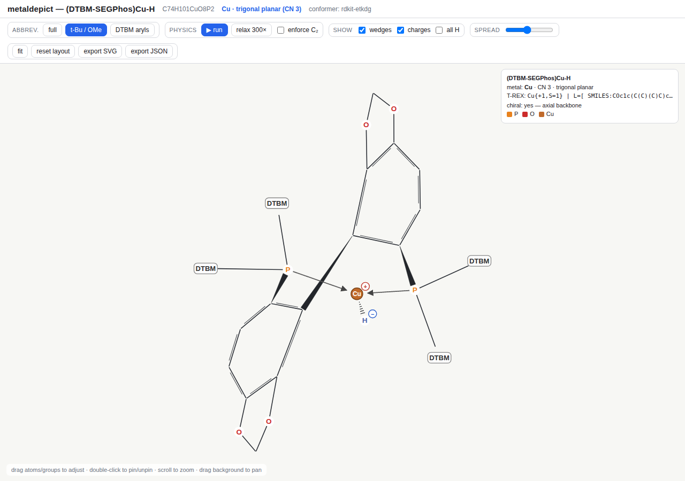

# metaldepict — adjustable 2D depictions of metal–organic complexes

`metaldepict` turns a metal–organic complex into a **clean, movable, adjustable
2D depiction** that runs in the browser. It was built to solve a specific
problem: RDKit's default 2D layout of bulky bidentate-phosphine metal complexes
is an unreadable pile of overlapping rings. `metaldepict` keeps the chemistry
exact but spreads the structure out with a small physics engine, collapses
bulky groups to standard abbreviations, and conveys 3D arrangement with
wedge/dash bonds — **without** rendering an RDKit image or going full 3D.

The reference target is **(DTBM-SEGPhos)Cu–H**: the bidentate diphosphine
DTBM-SEGPhos chelating a trigonal Cu(I) hydride through its two phosphorus
atoms (C₇₄H₁₀₁CuO₈P₂).

| level | what it shows |
|-------|----------------|
| `full` | every heavy atom (the "honest" skeleton) |
| `t-Bu / OMe` | *t*-Bu and OMe folded to labels — the default |
| `DTBM aryls` | each whole DTBM aryl folded to one `DTBM` node — the whole core readable at a glance |



---

## Pipeline

```
 chem.py        build_complex.py     trex_bridge.py        depict.py          viewer/
 ─────────  →   ───────────────  →   ─────────────────  →  ─────────────  →   ──────────────
 build the      3D conformer         T-REX descriptor       2D depiction       interactive web
 ligand &       (Architector or      (metal / ligands /     graph (JSON):      viewer + physics
 CuH complex    RDKit ETKDG)         charge / symmetry /    coords, wedges,    engine, drag/pin,
 by graph                            chirality, canon.      abbreviations,     export SVG/JSON
 substitution                        T-REX string)          symmetry classes
```

### 1. Chemistry — `src/chem.py`
The parent **SEGPhos** backbone is built from a verified SMILES, then decorated
into **DTBM-SEGPhos by graph substitution**: for each of the four P-bound phenyl
rings we add *tert*-butyl at the two *meta* positions and methoxy at *para*.
This is done on the molecular graph (never by string-splicing SMILES, which
collides ring-closure digits and silently produces phosphole rings). The result
is verified to be C₇₄H₁₀₀O₈P₂ with phosphorus in no ring and the correct
3,5-di-*t*Bu-4-OMe pattern on all four rings. The CuH complex adds dative
P→Cu bonds and one covalent Cu–H.

### 2. 3D conformer — `src/build_complex.py`
A *sensible* 3D conformer is needed for stereochemistry (wedge/dash depth) and
to feed T-REX. Two backends:

* **Architector** (LANL) — the preferred, chemistry-aware generator: it places
  ligands in the correct coordination geometry and relaxes with GFN2-xTB. The
  code path (`try_architector`) is wired up with the proper `build_complex`
  input dict and runs automatically **when Architector + its xtb/openbabel
  backends are importable** (a conda environment).
* **RDKit ETKDG + UFF** — the always-available fallback used in this repo,
  enough to give every atom a believable out-of-plane position.

### 3. T-REX descriptor — `src/trex_bridge.py`
Ilia Kevlishvili's **T-REX** (`trex-notation`) provides the transition-metal-
complex descriptor:

* `noncanonical_trex_model_from_xyz` perceives the metal / ligands / coordination
  from the 3D conformer (kept under `meta.trex.perceived`).
* `canonical_known_trex` builds the chemically-correct `TrexFull`
  (Cu(I), bidentate diphosphine + hydride, CN 3, `G:trpl`) and runs it through
  T-REX's own `canonicalize_full` to emit a canonical T-REX string —
  `Cu{+1,S=1} | L=[ SMILES:…DTBM-SEGPhos…, SMILES:[H-] ] | …`. This is more
  reliable than perceiving an exotic hydride from a raw all-hydrogen xyz, where
  the metal-bound H is indistinguishable from the ~100 other hydrogens.

### 4. Depiction graph — `src/depict.py`
Builds the JSON the viewer renders:

* **2D layout** from RDKit CoordGen on the ligand, with the metal/hydride placed
  geometrically — a clean starting point the physics engine refines.
* **Abbreviations** at two nesting levels (`abbreviations.py` + whole-aryl groups).
* **Symmetry**: canonical-rank equivalence classes, the C₂ mirror axis, and
  mirror-pair atom list.
* **Wedge/dash** perceived from the 3D conformer's out-of-plane depth (PCA plane)
  on the stereochemically meaningful bonds (metal–donor, P–Cipso, biaryl axis).
* **Charges**: formal charges plus the ionic overlay (Cu⁺ / H⁻).

### 5. Viewer — `viewer/`
A dependency-free single page (`index.html` + `viewer.js` + `style.css`) that
loads `viewer/molecule_data.js` (`window.MOLECULE`).

---

## The 2D physics engine

A small force simulation (in `viewer.js`) relaxes the layout while keeping
standardised geometry:

* **1–2 bond springs** pull every bond to a standardised rest length
  (aromatic/single, P→Cu dative longer, Cu–H shorter).
* **1–3 angle springs** hold standardised bond *angles* — preserved from the
  clean CoordGen layout for the organic framework, and forced to an ideal **120°**
  at the trigonal metal centre.
* **Fragment repulsion + hard collision** between non-bonded nodes (with large
  collision radii on abbreviation superatoms) — this is what spreads the four
  bulky aryls apart and **reduces overlap**.
* **Optional C₂ symmetrisation** reflects mirror-paired atoms across the
  Cu–backbone axis so equivalent groups are placed symmetrically.

Everything is **adjustable**: drag any atom or group (it pins where you drop it),
double-click to pin/unpin, scroll to zoom, drag the background to pan, and the
`spread` slider tunes repulsion. Export the current layout as **SVG** or **JSON**.

---

## Running it

```bash
pip install -r metaldepict/requirements.txt        # rdkit, numpy, trex-notation
python metaldepict/generate.py                      # writes data/*.json + viewer/molecule_data.js
# then open metaldepict/viewer/index.html in a browser
```

`generate.py` regenerates the depiction for `(DTBM-SEGPhos)Cu–H`. To depict a
different complex, build its RDKit mol + coordination info in `chem.py` and reuse
`build_complex.generate_conformer` / `depict.build_depiction`.

### Optional: enable Architector
Architector needs a conda environment (xtb + openbabel):
```bash
conda install -c conda-forge architector
```
With it importable, `generate.py` automatically uses the GFN2-xTB conformer.

---

## Files

```
metaldepict/
├── generate.py                 end-to-end pipeline (run this)
├── requirements.txt
├── src/
│   ├── chem.py                 SEGPhos → DTBM-SEGPhos (graph substitution) → CuH complex
│   ├── build_complex.py        3D conformer (Architector-optional / RDKit)
│   ├── trex_bridge.py          T-REX descriptor + canonical string
│   ├── abbreviations.py        t-Bu / OMe / CF3 … group detection
│   └── depict.py               2D layout, wedges, symmetry, charges → JSON
├── viewer/
│   ├── index.html              the app
│   ├── viewer.js               renderer + 2D physics engine + interaction
│   ├── style.css
│   └── molecule_data.js        auto-generated window.MOLECULE
└── data/
    ├── cuh_dtbm_segphos.json    depiction graph
    └── cuh_dtbm_segphos.xyz     3D conformer
```

## Notes & limitations
* In this repository the conformer comes from RDKit ETKDG (Architector's xtb/
  openbabel backends are not installed); the Architector path is ready for a
  conda environment.
* T-REX's raw xyz perception of this Cu-hydride reports a 2-coordinate metal
  because the hydride is ambiguous among the explicit hydrogens — so the
  depiction uses the chemically-correct CN 3 / trigonal descriptor (from
  `canonical_known_trex`) and keeps the raw perception under `meta.trex.perceived`.
* Wedge/dash convey relative 3D depth from the conformer; they are a depiction
  aid, not a CIP stereo-descriptor assignment.

## Credits
* **T-REX** (`trex-notation`) — Ilia Kevlishvili. Transition-metal-complex string
  notation, perception, canonicalisation, chirality.
* **Architector** — Los Alamos National Laboratory. Inorganic/organometallic
  conformer generation.
* **RDKit** — cheminformatics toolkit (ligand construction, CoordGen, SMARTS).
